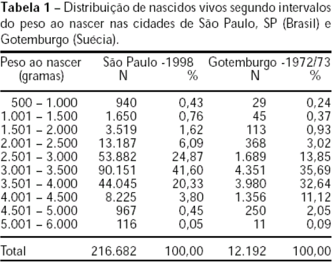

## Init

```{r, message=FALSE}
library(tidyverse)
library(jmv)
```

## Dataset import

```{r, message=FALSE}
hand1994_babies <- read_csv("data/hand1994_babies.csv", 
    col_types = cols(Survival = col_factor(levels = c("no", "yes"))))

hand1994_elderheight <- read_lines("data/hand1994_elderheight.csv") %>%
  str_split_fixed(" ", n = Inf) %>%
  as.numeric %>%
  na.omit()

hand1994_snore <- read_csv("data/hand1994_snore.csv", 
    quote = "\\\"")

hand1994_maternaldiet <- read_csv("data/hand1994_maternaldiet.csv")
```

## Question 1 - Slide 15

Make a Two-way table of the hand1994_babies dataset.

```{r}
summary(hand1994_babies) # Dataset summary
```

```{r}
hand1994_babies %>% # Make incidence table
  mutate(Weight = cut_interval(Weight, 5)) %>% # Bin Weight in 5 intervals
  count(Survival, Weight) %>% # Count of each pair case
  group_by(Weight) %>% # Set Weight as exp. variable
  spread(Survival, n, fill = 0) # Make Survival as columns
```

```{r}
hand1994_babies %>% # Make prevalence table
  mutate(Weight = cut_interval(Weight, 5)) %>% # Bin Weight in 5 intervals
  count(Survival, Weight) %>% # Count of each pair case
  group_by(Weight) %>% # Set Weight as exp. variable
  mutate(prop = round(n / sum(n), 2)) %>% # Calc proportion
  select(-n) %>% # Remove pair incidence
  spread(Survival, prop, fill = 0) # Make Survival as columns
```

## Question 4 - Slide 16

Analyze hand1994_elderheight dataset.

```{r}
summary(hand1994_elderheight) # Dataset summary
```

```{r}
length(hand1994_elderheight) # Total incidence
```

```{r}
hand1994_elderheight %>% # Binned incidence
  data.frame() %>%
  transmute(Height = cut_width(.,5)) %>% # Bin Height in 5 cm intervals
  count(Height)
```

## Question 5 - Slide 17

Complete the prevalence two-way table of the hand1994_snore dataset.

```{r}
hand1994_snore
```

```{r}
hand1994_snore %>% # Snoring as exp. variables:
  mutate(Total = Sim+Nao,
         Sim = Sim/Total,
         Nao = Nao/Total, Total = 1) %>%
  mutate(across(where(is.numeric), round, 2))
```

```{r}
hand1994_snore %>% # Cardio disiases as exp. variables, just for curiosity:
  pivot_longer(-`Ronco noturno`, names_to = "Doenca cardiaca") %>% # Dataframe rotation
  pivot_wider(names_from = `Ronco noturno`) %>%
  mutate(Total = Nao+Ocasional+`Quase todas as noites`+Sempre,
         Nao = Nao/Total,
         Ocasional = Ocasional/Total,
         `Quase todas as noites` = `Quase todas as noites`/Total,
         Sempre = Sempre/Total,
         Total = 1) %>%
  mutate(across(where(is.numeric), round, 2))
```

## Question 6 - Slide 18

Complete the prevalence two-way table of the hand1994_maternaldiet dataset, with control and cases as exp. var.

```{r}
hand1994_maternaldiet
```

```{r}
hand1994_maternaldiet %>% # Experimental population as exp. variables:
  pivot_longer(-`Dieta materna`, names_to = "Exp_pop") %>% # Dataframe rotation
  pivot_wider(names_from = `Dieta materna`) %>%
  mutate(Total = Boa+Razoavel+Pobre,
         Boa = Boa/Total,
         Razoavel = Razoavel/Total,
         Pobre = Pobre/Total,
         Total = 1) %>%
  mutate(across(where(is.numeric), round, 2))
```

## Question 7 - Slide 19

Comment the following results (MONTEIRO CA et al. (Rev. Saúde Pública; 2000:34 (6, supl): 26-40)):



The population birth weight ("desfecho") is explained by the birth location (exp. var.). Sao Paulo - 1998 appears to have a slightly lower mean birth weight than Gotenburgo - 1972/73. Both are in (3000 - 3500] g. Circa 30 years later, Sao Paulo presents a higher prevalence of low-weight births and a lesser of high-weight. It is an indicative of the difference of development of these cities. Note that the analysis of proportion allow us to compare the two cities.
